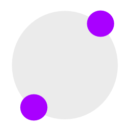

#  Dexgraph
 
  

**Under Development**

**Attention**

I've created a [ExDgraph Fork](https://github.com/Fulnir/exdgraph) (GRPC dgraph client) and it's possible, that this package will be deprecated in the near future. 
Or I create a package as a layer on the top of the GPRC-Client.

Copyright © 2018 Edwin Bühler  